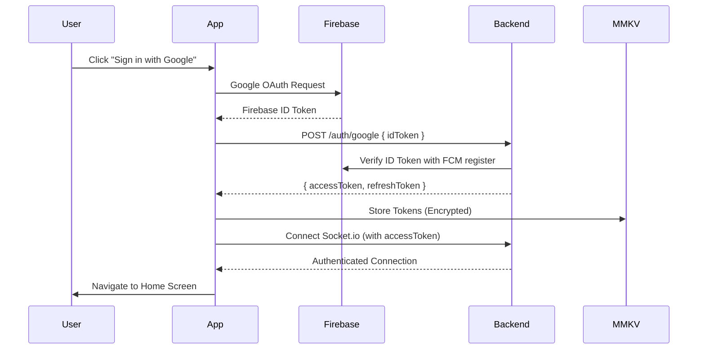

# 🎥 Twalky - Real-Time Video Calling Platform

[](https://reactnative.dev/)
[](https://firebase.google.com/)
[](https://socket.io/)
[](https://webrtc.org/)

> **Building a production-ready video calling application with secure authentication, real-time notifications, and scalable SFU architecture.**

---

## 📊 Project Evolution & Current Status

### Version History

| Version | Description | Status | Demo |
|---------|-------------|--------|------|
| **v1.0** | Basic P2P WebRTC 1:1 Calls | ✅ Complete | [📹 Watch Demo](https://www.linkedin.com/posts/soham-aswar-18376b22a_webrtc-socketio-reactnative-activity-7389727341763006464-IJmL?utm_source=share&utm_medium=member_desktop&rcm=ACoAADlr5TMBJDyHWD7c5GOlnuECJv02ayZkEs0) |
| **v2.0** | Auth + Notifications + UI/UX | ✅ Complete | [📹 Watch Demo](https://drive.google.com/file/d/1gxzk3bu--s_-62vQrQr05Cftm6LcJyiW/view?usp=drive_link) |
| **v3.0** | Mediasoup SFU Architecture | 🚧 In Progress | Coming Soon |

### Current Status (v2.0)

**✅ Production-Ready Components:**
- Google OAuth Authentication with JWT
- Push Notifications (Foreground/Background/Quit)
- Complete UI Flow (Login → Home → Profile → Join → Prepare)
- Developer Debug Panel
- Real-time Socket.io Signaling

**🚧 Active Development:**
- Upgrading from P2P WebRTC to Mediasoup SFU
- LiveMeetScreen with enhanced video layout
- Group call support (20+ participants)

**📝 Note:** WebRTC P2P implementation (v1.0) is preserved in codebase (`useWebRTC` hook) but being upgraded to Mediasoup for better scalability.

---

## ✨ Features (v2.0 - Current)

### 🔐 Authentication System
- ✅ **Google Sign-In** - Firebase OAuth integration
- ✅ **JWT Tokens** - Dual token system (Access + Refresh)
- ✅ **Auto Refresh** - Seamless token renewal without logout
- ✅ **Secure Storage** - MMKV for encrypted local storage
- ✅ **Socket.io Auth** - Authenticated real-time connections

### 🔔 Push Notifications (FCM + Notifee)
- ✅ **Foreground** - Custom UI notifications when app is active
- ✅ **Background** - System notifications when app minimized
- ✅ **Quit State** - Notifications when app is closed
- ✅ **Navigation** - Deep linking from notifications

### 📱 User Interface (Complete Flow)
- ✅ **Login Screen** - Google Sign-In with Firebase
- ✅ **Home Screen** - Create or join meeting options
- ✅ **Profile Screen** - User info, settings, logout
- ✅ **Join Screen** - Enter meeting code
- ✅ **Prepare Screen** - Preview camera/mic before joining
- ✅ **Developer Panel** - Debug tool (tap version 5x to access)
- 🚧 **LiveMeet Screen** - Upgrading from P2P to Mediasoup SFU

### 🎥 Video Calling Evolution
- ✅ **v1.0: WebRTC P2P** - Direct peer-to-peer connections (1:1 calls)
- 🚧 **v3.0: Mediasoup SFU** - Selective Forwarding Unit for scalable group calls
- ✅ **Signaling** - Socket.io for offer/answer/ICE exchange
- ✅ **Media Controls** - Camera toggle, mute/unmute, camera switch

### 🔧 Developer Tools
- ✅ **Hidden Debug Panel** - Access by tapping version 5 times
- ✅ **Token Inspector** - View/copy JWT tokens with expiry
- ✅ **Socket Monitor** - Real-time connection status
- ✅ **FCM Dashboard** - Device token and registration info
---

## 🎬 Demo Videos

### v1.0 Demo - Basic WebRTC P2P

> **First Implementation:** Basic peer-to-peer video calling with WebRTC

**Video:** 


**Features shown:**
- 1:1 video call connection
- Camera and audio controls
- WebRTC offer/answer signaling
- ICE candidate exchange

---

### v2.0 Demo - Current Features

> **Current Implementation:** Authentication, Notifications, and Complete UI

**Video:** 


---

## 🛠️ Tech Stack

### Frontend
```javascript
{
  "core": {
    "framework": "React Native 0.80.2",
    "language": "JavaScript (ES6+)",
    "cli": "React Native CLI (not Expo)"
  },
  "navigation": {
    "@react-navigation/native": "^6.1.6",
    "@react-navigation/native-stack": "^7.3.22"
  },
  "state": {
    "zustand": "State management"
  },
  "storage": {
    "react-native-mmkv": "High-performance encrypted storage"
  },
  "authentication": {
    "@react-native-firebase/auth": "^22.4.0",
    "@react-native-firebase/app": "^22.4.0"
  },
  "notifications": {
    "@react-native-firebase/messaging": "^22.4.0",
    "@notifee/react-native": "^9.1.8"
  },
  "realtime": {
    "socket.io-client": "^4.x",
    "react-native-webrtc": "P2P implementation (preserved)"
  },
  "ui": {
    "react-native-gesture-handler": "^2.27.2",
    "react-native-safe-area-context": "^5.5.2",
    "react-native-screens": "^4.13.1"
  }
}
```

### Backend
```javascript
{
  "runtime": "Node.js 18+",
  "framework": "Express.js",
  "database": "MongoDB + Mongoose",
  "auth": "JWT + Firebase Admin SDK",
  "realtime": "Socket.io ^4.6.x",
  "video": "Mediasoup SFU (In Progress)",
  "notifications": "Firebase Cloud Messaging"
}
```

---

## 🔐 Authentication Flow



**Auto Token Refresh:**
```
API Request → 401 Error → Axios Interceptor → Use Refresh Token → Get New Access Token → Retry Request → Success
```
---

## 🚀 Quick Start

### Prerequisites
- Node.js >= 18
- React Native CLI
- Android Studio or Xcode
- Firebase Project

### Installation

```bash
# 1. Clone
git clone https://github.com/soham444101/Twalky-Frontend.git
cd Twalky-Frontend

# 2. Install dependencies
npm install

# 3. iOS Setup (Mac only)
cd ios && pod install && cd ..

# 4. Add Firebase config files
# - android/app/google-services.json
# - ios/GoogleService-Info.plist

# 5. Create .env file
echo "API_URL=http://your-ip:5000" > .env
echo "SOCKET_URL=http://your-ip:5000" >> .env

# 6. Run
npm start
npm run android  # or npm run ios
```

---

## 🔧 Key Implementation Details

### 1. MMKV Storage 
```javascript
// src/services/storageService.js
import { MMKV } from "react-native-mmkv";

export const storage = new MMKV(
    {
        id: "user-storage",
        encryptionKey: "secure-key-is-sasa"
    }
)

export const mmkvstorage = {
    setItem: (key, value) => {
        storage.set(key, value);
    },
    getItem:(key)=>{
        const value = storage.getString(key)
        return value ?? null;
    }
    ,
    removeItem: (key) => {
        storage.delete(key);
    }

}
```

### 2. Auto Token Refresh (Axios Interceptor)
```javascript
// src/services/api.js
import axios from 'axios';
import { getToken, setToken } from './storageService';

const api = axios.create({ baseURL: API_URL });

 this.apiClient.interceptors.response.use(
      (response) => response,
      async (error) => {
        const originalRequest = error.config;
        console.log("Interceptors error calls", error)
        console.log("Interceptors error calls", error?.message)
        console.log("This.isRefereshing", this.isRefreshing)
        if (error.response?.status === 401 && !originalRequest._retry && !originalRequest.url.includes('/auth/logout')) {
          if (this.isRefreshing) {
            // Wait for refresh to complete
            return new Promise((resolve, reject) => {
              this.refreshSubscribers.push((token, error) => {
                if (error) {
                  return reject(error);
                }
                originalRequest.headers.Authorization = `Bearer ${token}`;
                resolve(this.apiClient(originalRequest));
              });
            });
          }

          originalRequest._retry = true;
          this.isRefreshing = true;

          try {
            const newAccessToken = await this.refreshAccessToken();

            // Notify all waiting requests
            this.refreshSubscribers.forEach((callback) => callback(newAccessToken));
            this.refreshSubscribers = [];

            // Retry original request
            originalRequest.headers.Authorization = `Bearer ${newAccessToken}`;
            return this.apiClient(originalRequest);
          } catch (refreshError) {
            // Refresh failed - logout user
            this.refreshSubscribers.forEach((callback) => callback(null, refreshError));
            this.refreshSubscribers = [];
            this.handleLogout();
            return Promise.reject(refreshError);

          } finally {
            this.isRefreshing = false;
          }
        }

        return Promise.reject(error);
      }
    );
```

### 3. Push Notifications (All States)
```javascript
// App.js
import messaging from '@react-native-firebase/messaging';
import notifee from '@notifee/react-native';

// Foreground
 /// this we are using when the user app open and after click notification what happens
    const unsubscribeF = notifee.onForegroundEvent(({ type, detail }) => {
      if (type === EventType.PRESS) {
        const { Screen } = detail.notification?.data;
        if (typeof (Screen) == "string" && Screen.length > 0) {
          // console.log("Inside If");
          navigate(Screen);
        }
        console.log("Notification tapped", detail.notification?.data);
        console.log("Types", type);
      }
    });

// Background (index.js)
    // This when app is in background and we perform some thing when click on notification
    const unsubscribeAppdiedState = messaging().onNotificationOpenedApp(() => {
      console.log("Notification opened from background:", remoteMessage);
      const screen = remoteMessage.data?.Screen;
      if (screen) navigate(screen);
    })

// Quit state
const checkInitialNotification = async () => {
      const remoteMessage = await messaging().getInitialNotification();
      if (remoteMessage) {
        console.log("App opened from killed state via notification:", remoteMessage);
        const screen = remoteMessage.data?.Screen;
        if (screen) navigate(screen);
      }
    };
    checkInitialNotification();
```

### 4. WebRTC Hook (v1.0 - Preserved)
```javascript
// src/hooks/useWebRTC.js
// This hook is still present but being upgraded to Mediasoup

const useWebRTC = () => {
  const {
    sessionId,
    participants,
    micOn,
    videoOn,
    addParticipant,
    removeParticipant,
    updateParticipant,
    setStreamURL,
    toggle,
    clear,
  } = meetStore();
  const { user } = useUserStore();
  // P2P implementation preserved for reference
  // Being replaced with Mediasoup producer/consumer pattern
};
```

---

## 📊 Development Roadmap

### ✅ v1.0 - Basic WebRTC P2P (Complete)
- [x] WebRTC peer-to-peer 1:1 calls
- [x] Offer/answer/ICE exchange via Socket.io
- [x] Camera and audio controls
- [x] Basic UI for video calls

### ✅ v2.0 - Authentication & Notifications (Complete)
- [x] Google OAuth with Firebase
- [x] JWT token management (Access + Refresh)
- [x] Auto token refresh mechanism
- [x] Push notifications (FCM + Notifee)
- [x] Complete UI flow (Login → Home → Join → Prepare)
- [x] Profile screen with settings
- [x] Developer debug panel
- [x] MMKV storage

### 🚧 v3.0 - Mediasoup SFU (In Progress - 60% Complete)
- [x] Mediasoup server setup
- [x] Room and router management
- [ ] Producer/consumer implementation
- [ ] LiveMeetScreen with SFU architecture
- [ ] Multiple participant video layout
- [ ] Group calls (15+ participants)
- [ ] Network quality indicators

### 📋 v3.5 - Enhanced Features (Planned)
- [ ] Call history with Firestore
- [ ] User presence system
- [ ] Screen sharing
- [ ] In-call text chat
- [ ] Recording functionality
- [ ] Virtual backgrounds

---

## 🎯 Why Upgrading from P2P to SFU?

### WebRTC P2P (v1.0)
```
👤 ←→ 👤  (2 participants = 1 connection)
Perfect for 1:1 calls

❌ Problem: Doesn't scale
👤 ←→ 👤
 ↕     ↕
👤 ←→ 👤  (4 participants = 6 connections)
N*(N-1)/2 connections = High bandwidth
```

### Mediasoup SFU (v3.0)
```
👤 → 📡 → 👤
     ↕
👤 ← 📡 ← 👤
(4 participants = 4 connections to server)

✅ Scalable to 50+ participants
✅ Lower client bandwidth
✅ Better quality control
```

---

## 🐛 Known Issues & Solutions

| Issue | Status | Solution |
|-------|--------|----------|
| Dark mode toggle works but UI not fully themed | Known | Planned for v2.1 |
| Token refresh edge case on poor network | Minor | Added retry logic |
| WebRTC P2P limited to 1:1 | By Design | Upgrading to Mediasoup SFU |

---

## 🔗 Related Repositories

- **Backend:** [Twalky-Mediasoup-Backend](https://github.com/soham444101/Twalky-Mediasoup-Backend)
- **Frontend:** You are here

---

## 👨‍💻 Author

**Soham Aswar**  
Full Stack & React Native Developer

- 📧 Email: sohamaswar@gmail.com
- 🔗 GitHub: [@soham444101](https://github.com/soham444101)
- 💼 LinkedIn: [Soham Aswar](https://linkedin.com/in/sohamaswar)
- 📍 Location: Pune, Maharashtra, India

---

## 🎯 For Interviewers

### What's Working Right Now:
✅ Google OAuth authentication flow  
✅ JWT token management with auto-refresh  
✅ Push notifications (all app states)  
✅ Complete UI flow from login to prepare screen  
✅ Developer panel for debugging  
✅ Socket.io real-time signaling  

### What's In Progress:
🚧 Upgrading video calling from P2P to Mediasoup SFU  
🚧 Enhanced LiveMeetScreen UI  
🚧 Group call support  

### Demo Available:
📹 v1.0: Basic P2P video calling  
📹 v2.0: Current implementation (auth, notifications, UI)  

---

## 📞 Contact

For questions, collaboration, or opportunities:
- 📧 sohamaswar@gmail.com
- 💼 [LinkedIn Profile](https://linkedin.com/in/sohamaswar)

---

## ⭐ Show Your Support

If this project interests you, please consider giving it a star!

---

*Last Updated: November 2025*  
